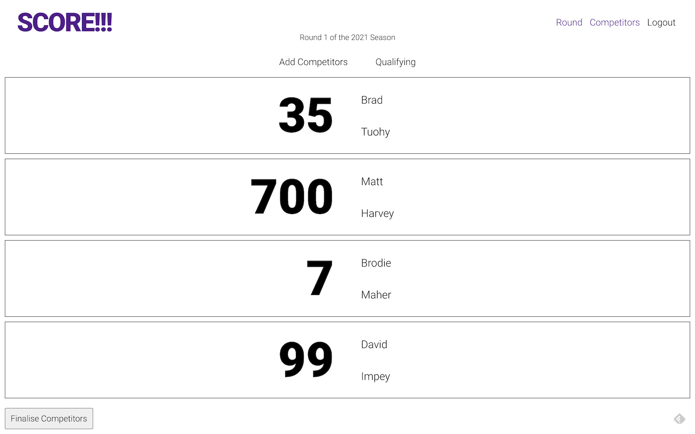
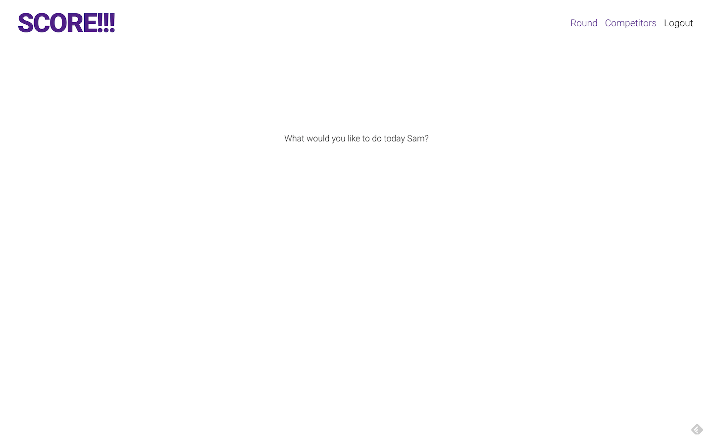
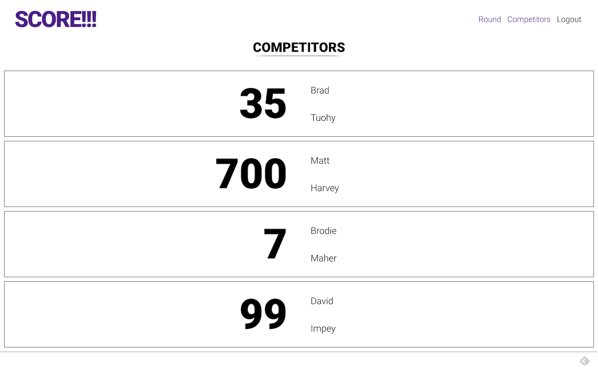
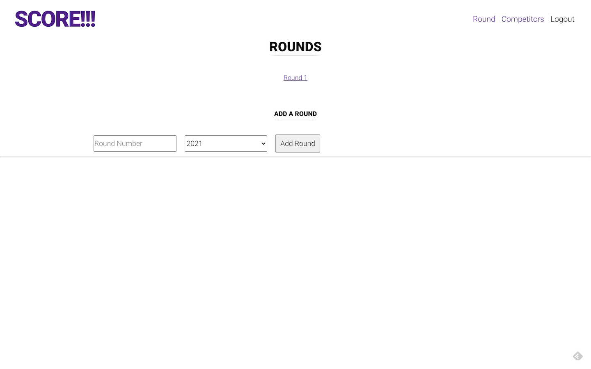
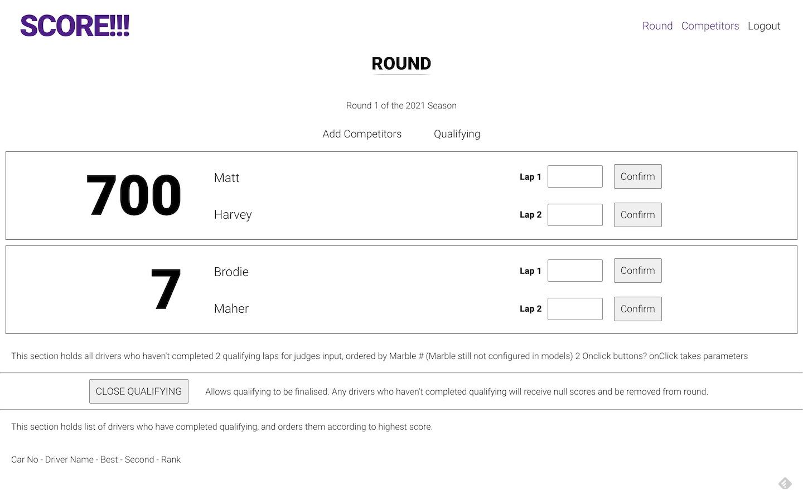

# SCORE!!!

An App for competition scoring

## Deployment

SCORE!!! has been deployed at:
[https://sl-score.herokuapp.com/](https://sl-score.herokuapp.com/)

## Technologies

- MongoDB (Mongoose & Mongo Atlas)
- Express
- React
- Node.js
- GraphQL (Apollo Express Server & Client)
- JSON Web Token
- SASS

## Description

SCORE!!! is an app for competition scoring. It was built to reduce the time administering competitions and automate a large part of competition scoring.

## What We Did

The entire app has been built over the course of 2 weeks. Back-End Mongo Models were built with future developments in mind, with Graph QL typeDefs, reducers, queries & mutations added to reflect the models. JSON Web Token was also built in to handle user signups & logins.

The Front-End was developed with React & SASS.  
The App is also installable as a Progressive Web App.

SCORE is not 100% fully functional yet, and will continue to be developed.

## Screenshots

## Future Development

There is plenty more in store for SCORE!!!

- Allow for multiple rounds & seasons
- Allow multiple judges to login & score
- Compile head-to-head (battle) tree layout
- Allow for judging by vote for head-to-head matches (battles)
- Display competition standings for a season per round
- Competitor signup/registration (& Payment)
- Live scoring display for non-logged in users.
- Points allocation for qualifying & battles
- Call sheet/Notifications for staff/competitors
- Forecasting capabilities for commentators
- Allow for other competition types to use the app

